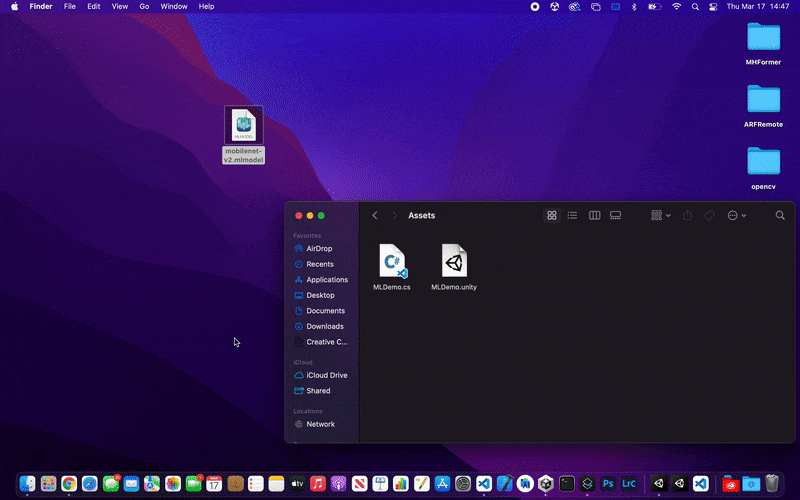
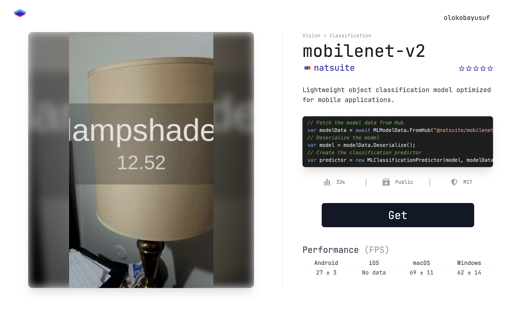

# NatML


NatML allows developers to integrate machine learning into their Unity applications in under five lines of code with zero infrastructure. NatML completely removes the need to have any experience with machine learning in order to take advantage of the features it can provide. Features include:

- **Universal Machine Learning**. With NatML, you can drop CoreML (`.mlmodel`), TensorFlow Lite (`.tflite`), and ONNX (`.onnx`) models directly into your Unity project and run them.

- **Bare Metal Performance**. NatML takes advantage of hardware machine learning accelerators, like CoreML on iOS and macOS, NNAPI on Android, and DirectML on Windows. As a result, it is [multiple times faster](https://github.com/natmlx/ml-bench) than Unity's own Barracuda engine.

- **Cross Platform**. NatML supports Android, iOS, macOS, WebGL, and Windows alike. As a result, you can build your app once, test it in the Editor, and deploy it various platforms and devices all in one seamless workflow.

- **Extremely Easy to Use**. NatML exposes machine learning models with simple classes that return familiar data types. These are called "Predictors", and they handle all of the heavy lifting for you. No need to write pre-processing scripts or shaders, wrangle tensors, or anything of that sort.

- **Growing Catalog**. NatML is designed with a singular focus on applications. As such, we maintain a growing catalog of predictors that developers can quickly discover and deploy in their applications. [Check out NatML Hub](https://hub.natml.ai).

- **Lightweight Package**. NatML is distributed in a self-contained package, with no external dependencies. As a result, you can simply import the package and get going--no setup necessary.

## Installing NatML
Add the following items to your Unity project's `Packages/manifest.json`:
```json
{
  "scopedRegistries": [
    {
      "name": "NatML",
      "url": "https://registry.npmjs.com",
      "scopes": ["ai.natml"]
    }
  ],
  "dependencies": {
    "ai.natml.natml": "1.1.16"
  }
}
```

## Using ML Models



If you have a CoreML, ONNX, or TensorFlow Lite model, you can simply drag and drop it into your project. [See the documentation for more details](https://docs.natml.ai/unity/workflows/models).

> Note that specific model formats can only be used on specific platforms. CoreML models can only be used on iOS and macOS; ONNX can only be used on Windows; and TensorFlow Lite can only be used on Android. Use [NatML Hub](https://hub.natml.ai) to convert your model to different ML formats.

## Discover ML Models on NatML Hub
**[Create an account on NatML Hub](https://hub.natml.ai/profile)** to find and download ML predictors to use in your project!



You can also [upload your models to Hub](https://hub.natml.ai/create) and make them private or public. [Check out the documentation](https://docs.natml.ai/unity/api/mledgemodel) for information on writing predictors for your models.

## Using ML Models in Two Simple Steps
You will always use NatML in two steps. First, create a **predictor** by fetching model data from [NatML Hub](https://hub.natml.ai) or by loading a local ML model file in your project (`.mlmodel`, `.tflite`, and `.onnx`):
```csharp
// Create the MobileNet v2 predictor
var predictor = await MobileNetv2Predictor.Create();
```

Then make predictions with the predictor:
```csharp
// Make prediction on an image
Texture2D image = ...;
var (label, score) = predictor.Predict(image);
```

Different predictors accept and produce different data types, but the usage pattern will always be the same.

___

## Requirements
- Unity 2022.3+

## Supported Platforms
- Android API Level 24+
- iOS 14+
- macOS 10.15+ (Apple Silicon and Intel)
- Windows 10+ (64-bit only)
- WebGL:
  - Chrome 91+
  - Firefox 90+
  - Safari 16.4+

## Resources
- Join the [NatML community on Discord](https://natml.ai/community).
- See the [NatML documentation](https://docs.natml.ai/unity).
- Check out [NatML on GitHub](https://github.com/natmlx).
- Read the [NatML blog](https://blog.natml.ai/).
- Contact us at [hi@natml.ai](mailto:hi@natml.ai).

Thank you very much!